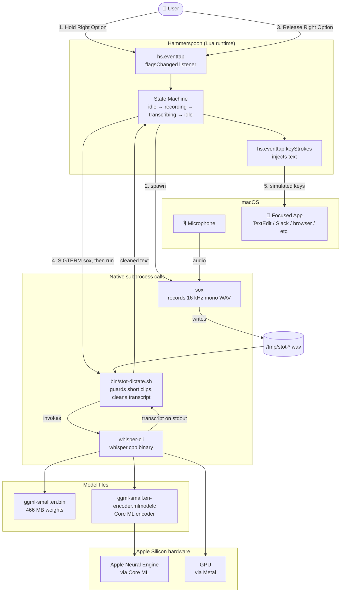

# stot — Local Push-to-Talk Dictation for macOS

Hold a key. Speak. Release. The transcript types itself into whatever app you're focused on.

100% local. No cloud, no API keys, no subscriptions. Powered by [whisper.cpp](https://github.com/ggerganov/whisper.cpp) and [Hammerspoon](https://www.hammerspoon.org/).

## How it works

```
Hold Right Option ─▶ sox records mic to a WAV
Release          ─▶ whisper.cpp transcribes the WAV (Core ML + Metal accelerated)
                 ─▶ Hammerspoon types the transcript via simulated keystrokes
```

## Architecture



The three small pieces that make this work:

| Component | Role |
| --- | --- |
| `whisper.cpp` | Local STT inference (one C++ binary + a model file) |
| `bin/stot-dictate.sh` | Glue: WAV in → transcript out |
| `hammerspoon/init.lua` | Hotkey listener + orchestration + keystroke injection |

## Requirements

- **macOS on Apple Silicon** (M1 / M2 / M3 / M4). Intel Macs will mostly work but Core ML acceleration won't kick in — you'll fall back to Metal-only, which is still usable.
- **Homebrew** — https://brew.sh
- **Xcode** (full app from the Mac App Store, not just Command Line Tools) — only needed once, for the Core ML model compile step. If you skip Core ML you can avoid this; see [Skipping Core ML](#skipping-core-ml) below.
- ~2 GB free disk: whisper.cpp source + `small.en` model + Core ML companion + a Python venv used only at install time.

## Install

```sh
git clone git@github.com:abhishekonline/stot.git ~/stot
cd ~/stot
./install.sh
```

`install.sh` is idempotent — re-running it skips any step that's already done.

What it does, in order:

1. Installs `sox` and `cmake` via Homebrew (skipped if present).
2. Clones whisper.cpp into `~/.local/share/whisper.cpp` and builds it with Core ML support.
3. Downloads the `ggml-small.en` model (~466 MB) into `./models/`.
4. Creates a Python 3.11 venv at `./.venv-coreml`, installs `torch`, `coremltools`, `openai-whisper`, and `ane_transformers` (only used for one-time Core ML conversion). Installs `python@3.11` via Homebrew if missing.
5. Runs the Core ML conversion (a few minutes). Produces `models/ggml-small.en-encoder.mlmodelc`.
6. Symlinks `hammerspoon/init.lua` to `~/.hammerspoon/init.lua`.

If step 5 fails with `xcrun: error: unable to find utility "coremlc"`, you need full Xcode:

```sh
# Install Xcode from the Mac App Store, then:
sudo xcode-select -s /Applications/Xcode.app/Contents/Developer
sudo xcodebuild -license accept
# Re-run install.sh — it will pick up where it left off.
./install.sh
```

## Configure

Open `~/.hammerspoon/init.lua` (which is a symlink to `hammerspoon/init.lua` in this repo) and update the path constant at the top:

```lua
-- EDIT THIS to point at wherever you cloned the stot repo:
local REPO_ROOT = os.getenv("HOME") .. "/stot"
```

If you cloned into `~/code/stot`, change it to `os.getenv("HOME") .. "/code/stot"`.

## Install Hammerspoon and grant permissions

1. **Install Hammerspoon**:
   ```sh
   brew install --cask hammerspoon
   ```

2. **Launch Hammerspoon** (`open -a Hammerspoon`). A hammer icon appears in the menu bar.

3. **Reload the config**: Hammerspoon menu bar icon → **Reload Config**. You should see a "stot dictation loaded" alert.

4. **Grant three permissions** in **System Settings → Privacy & Security**:

   | Permission | Why |
   | --- | --- |
   | Accessibility | Capture the global hotkey + inject keystrokes into other apps |
   | Input Monitoring | Detect modifier key press/release globally |
   | Microphone | Record audio (via the sox subprocess) |

   Accessibility and Input Monitoring have a `+` button — add Hammerspoon manually.

   **Microphone has no `+` button.** It only lists apps that have already requested mic access. To trigger the request: hold Right Option and speak — macOS will prompt for mic access; click Allow. (If the prompt doesn't appear, open Hammerspoon's Console from the menu bar icon and paste:
   ```lua
   hs.task.new("/opt/homebrew/bin/sox", function() end, {"-d", "-r", "16000", "-c", "1", "-b", "16", "/tmp/permtest.wav"}):start()
   ```
   This forces a mic prompt within a second.)

5. After granting permissions, **Reload Config** again.

## Use it

1. Open any app — TextEdit, your browser, Slack, terminal, anywhere you can type.
2. **Hold Right Option** while speaking.
3. **Release** when done.

You'll see a "● Listening" alert while holding, then "✓" when the transcript types into your focused app (~0.5–1.5 s after release for short utterances).

That's it.

## Customization

Edit `hammerspoon/init.lua`:

- **Change the hotkey**: edit the `HOTKEY_FLAG` constant. Common values:
  - Right Option: `0x00000040` (default)
  - Right Command: `0x00000010`
  - Right Shift: `0x00000004`
  - Right Control: `0x00002000`

  After editing, click Hammerspoon menu bar icon → Reload Config.

- **Tell Whisper about your vocabulary**: if proper nouns like "Hammerspoon" or company-specific jargon transcribe wrong, edit `bin/stot-dictate.sh` and add a `--prompt` flag to the `whisper-cli` invocation:
  ```sh
  "$WHISPER_BIN" \
    -m "$MODEL" \
    -f "$WAV" \
    -l en \
    --prompt "Hammerspoon, Salesforce, kubectl, gRPC" \
    --no-timestamps \
    --no-prints \
    ...
  ```
  This nudges (doesn't guarantee) word choice.

- **Try a different model size**: in `bin/stot-dictate.sh` change `STOT_MODEL` default, and download the size you want:
  ```sh
  cd ~/.local/share/whisper.cpp
  bash ./models/download-ggml-model.sh base.en   # or tiny.en, medium.en, large-v3
  cp models/ggml-base.en.bin ~/stot/models/
  ```

  | Model | Size | Latency (5 s clip on M-series) | Notes |
  | --- | --- | --- | --- |
  | `tiny.en` | ~75 MB | ~0.2 s | Lowest accuracy |
  | `base.en` | ~150 MB | ~0.4 s | Good for casual use |
  | `small.en` | ~466 MB | ~0.8 s | **Default — best balance** |
  | `medium.en` | ~1.5 GB | ~1.5 s | Near-large quality |
  | `large-v3` | ~3 GB | ~3 s | Multilingual + best accuracy |

  For each new size you'll want to also generate the Core ML encoder; see step 5 in install.

## Skipping Core ML

Don't want to install full Xcode? You can run on **Metal only**. It's still fast on Apple Silicon — `small.en` transcribes a 5-second clip in ~1.5 s without Core ML.

In `install.sh`, comment out step 5 (the Core ML conversion block). Whisper.cpp will automatically fall back to Metal-only when it doesn't find the `.mlmodelc` directory.

## Troubleshooting

**Hotkey does nothing.** Check Hammerspoon's Console (menu bar → Console) for errors. Most often: a missing permission (Accessibility, Input Monitoring) or a `REPO_ROOT` path that doesn't match where you cloned.

**Recording is silent / transcript is empty.** Microphone permission not granted. See the mic-permission section above. Verify by recording a test clip and playing it back:
```sh
sox -d -r 16000 -c 1 -b 16 /tmp/test.wav trim 0 4 && afplay /tmp/test.wav
```

**Transcription is slow (>2 s for a short clip).** Core ML model isn't loaded. Verify:
```sh
ls ~/stot/models/ggml-small.en-encoder.mlmodelc/
```
If it's missing, re-run `./install.sh` after installing full Xcode.

**Transcript types into the wrong app.** Hammerspoon types into whatever has focus when the script finishes. If you change focus during the ~1 s after releasing the hotkey, the text follows. Stay in the target window.

**Garbled text / hallucinated words.** Mic input level too low. macOS System Settings → Sound → Input — check that the right device is selected and the input level meter responds when you speak.

**Build fails on `whisper.cpp`.** Make sure you have `cmake` from Homebrew (`brew install cmake`). If you upgraded macOS recently, also `brew upgrade cmake`.

## What's in this repo

```
stot/
├── README.md
├── LICENSE                    # MIT
├── install.sh                 # one-shot setup
├── bin/
│   └── stot-dictate.sh        # WAV → transcript wrapper
├── hammerspoon/
│   └── init.lua               # hotkey + orchestration (symlinked to ~/.hammerspoon)
├── models/                    # gitignored: the .bin and .mlmodelc go here
└── .venv-coreml/              # gitignored: Python venv for one-time Core ML conversion
```

## License

MIT. See [LICENSE](LICENSE).

This project bundles / depends on:
- [whisper.cpp](https://github.com/ggerganov/whisper.cpp) — MIT, © Georgi Gerganov
- [OpenAI Whisper models](https://github.com/openai/whisper) — MIT, © OpenAI
- [Hammerspoon](https://www.hammerspoon.org/) — MIT
- [sox](https://sox.sourceforge.net/) — GPL/LGPL (linked dynamically, used as a CLI tool)
